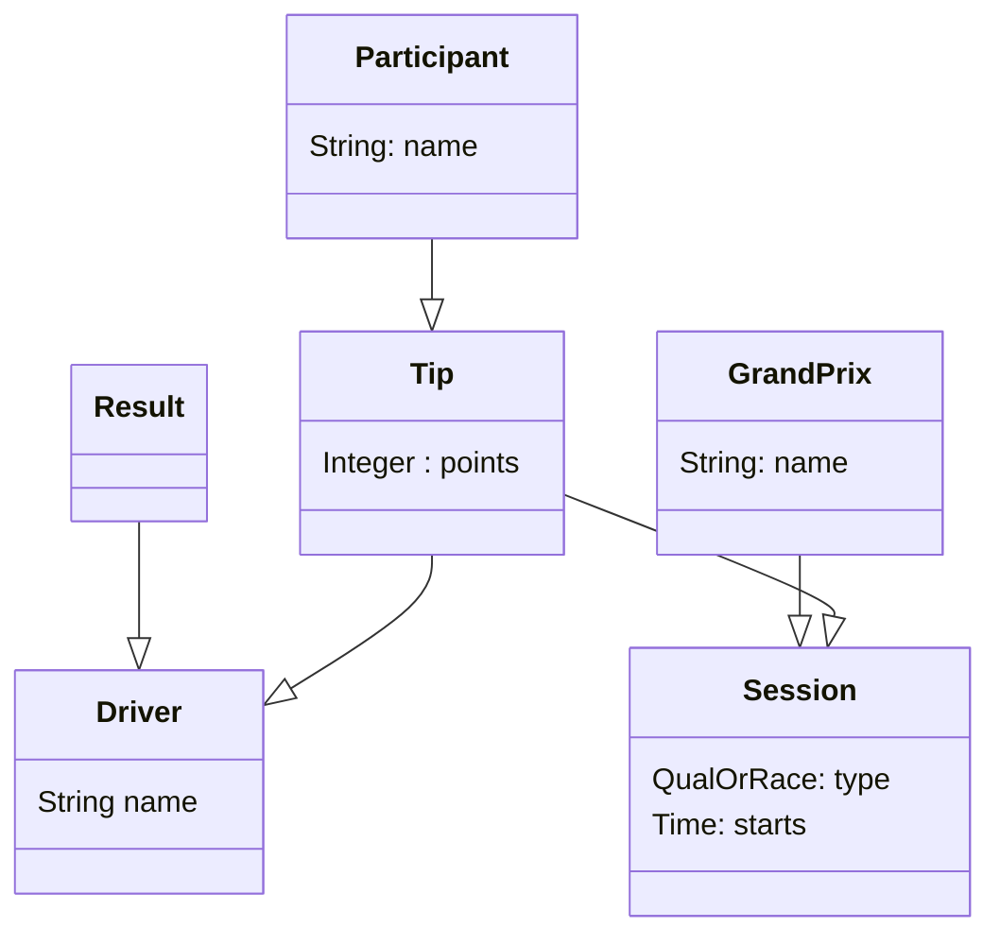

# Model

Example model, a F1 tip contest. Participants hand in their prediction on the top ten drivers in qualification and in race.

When the result for the session is established, the participants gets 3 points if they predicted the driver at correct position and 1 point for a driver at wrong position but ended up in top 10.

The participant with most points at the end of the year, wins.

## Entities

### Tip
A participant creates a tip for a session, consisting of a list of drivers that will finish top ten, in order.

### Driver
The F1 drivers is a list of drivers that enters at least one session during the year.

### Session
A session is either a qualification or a race. A session is part of a Grand Prix. A session has a start time which is the deadline for creating tips.

### Participant
The users of the system that creates tips.

### Result
When a session is over, there is a result which is a list of the top ten drivers, in order.

### Point
When there is a result, a tip receives points as described above.

